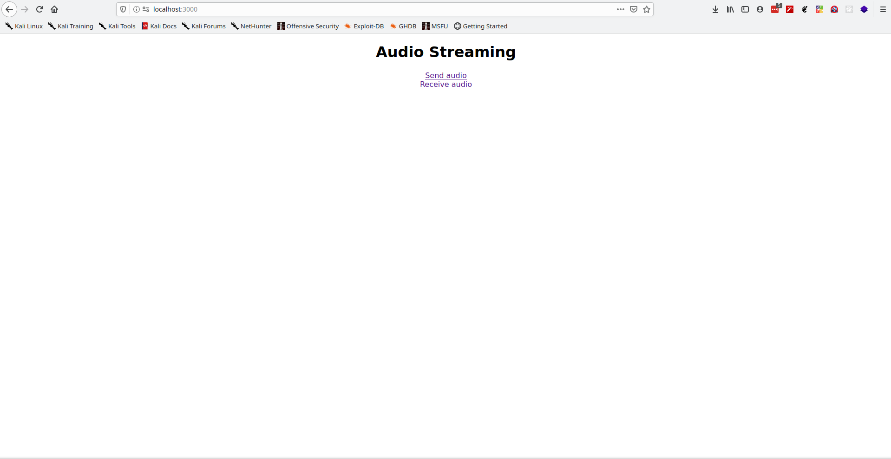
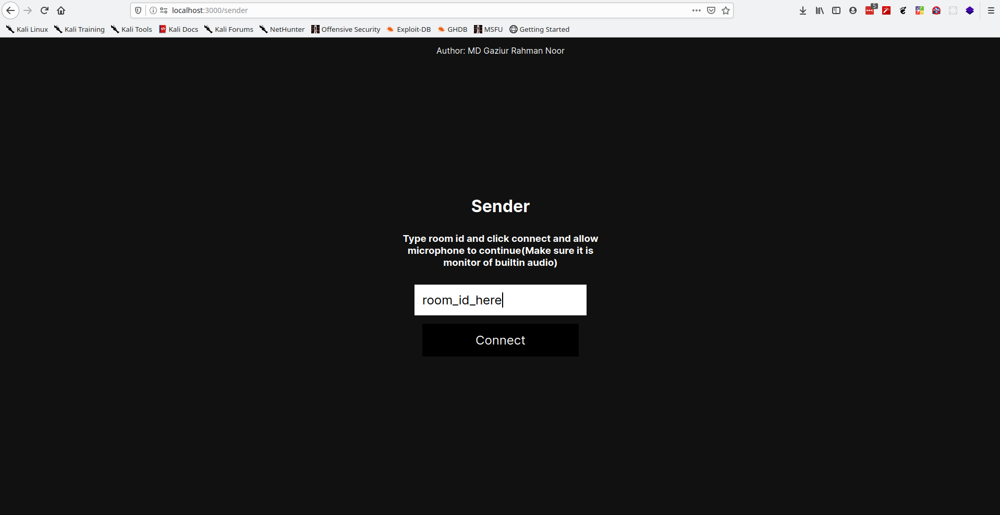
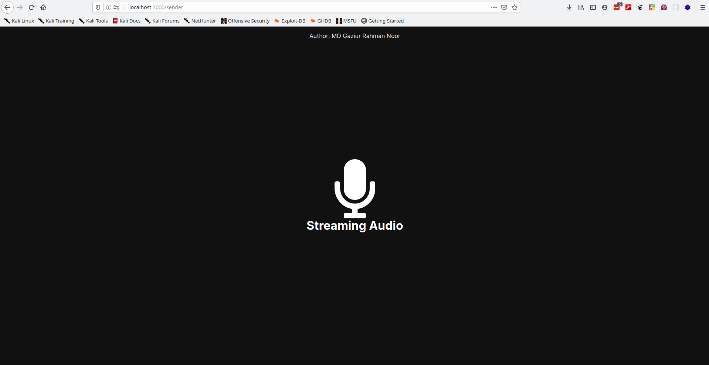
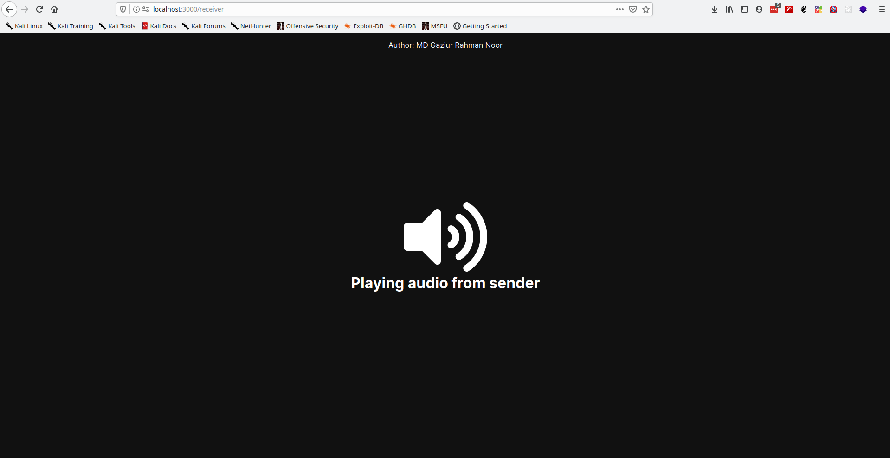

# Audio Streamer
Streams audio from input device to a room where receivers can play that

## Requirements
- NodeJS
- NPM(Node Package Manager)
- Router(Or any network where the server ip will be exposed)

## Setting up

- First clone this project by running ```git clone https://github.com/mdgaziur/audio-streamer```
- Run ```npm i``` to install all the dependencies
- Then run ```npm i -g peer```. You may need ```sudo``` if you are using linux.

## Starting the app
- Run ```npm start``` to start the web application
- Run ```peerjs --port 3001``` in another terminal

## Opening the web interface
- The app will show the ip address when it will start. Go to the address using a browser.

## Using the app

- ### Setting up the sender device
  - Click on the link which says ```Send audio```
  - Enter a room id(Very important!). This is the room which the receivers will connect to
  - When the browser asks to select the input device, select the appropiate one
- ### Setting up the receiver device
  - Click on the link which says ```Receive audio```
  - Enter the room id(Very important!). Make sure the room id is equal to the one you've entered on the sender device as this is the room where the audio will be broadcasted.


## Screenshots
### Index Page

### Sender Page

### Streaming Audio

### Receiver Page

### Playing Audio

